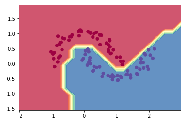
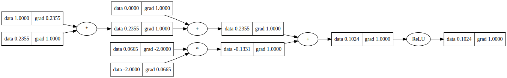

# micrograd


A tiny Autograd engine (with a bite! :)). Implements backpropagation (reverse-mode autodiff) over a dynamically built DAG and a small neural networks library on top of it with a PyTorch-like API. Both are tiny, with about 100 and 50 lines of code respectively. The DAG only operates over scalar values, so e.g. we chop up each neuron into all of its individual tiny adds and multiplies. However, this is enough to build up entire deep neural nets doing binary classification, as the demo notebook shows. Potentially useful for educational purposes.

## Learning Roadmap: From micrograd To LLM

这不是一次性啃完的资源清单，而是后面慢慢学、慢慢加的升级路线。每走完一段，都要留下一个能跑的代码结果和一篇过关笔记。

推荐顺序：

```text
micrograd
  -> D2L 选择性补基础
  -> Happy-LLM
  -> LLMs-from-scratch
  -> Hugging Face LLM Course
  -> nanoGPT
```

### 第一阶段：micrograd + D2L

目标：补牢“神经网络为什么能训练”。

从 micrograd 过渡到真实深度学习框架时，**PyTorch 是必修**，不是可选项。micrograd 负责把自动求导讲透，PyTorch 负责把同一套思想迁移到张量、批量数据和真实训练循环。

micrograd 过关问题：

```text
什么是计算图？
loss 是怎么反向传播的？
梯度是什么意思？
参数为什么能通过梯度下降变好？
为什么 PyTorch 里 loss.backward() 能算出每个参数的 grad？
```

D2L 先选择性看：

```text
线性回归
softmax 回归
多层感知机 MLP
反向传播
优化算法
Attention / Transformer
```

PyTorch 过关问题：

```text
torch.tensor(..., requires_grad=True) 和 Value 是什么关系？
loss.backward() 后 .grad 表示什么？
optimizer.zero_grad() / loss.backward() / optimizer.step() 的顺序为什么不能乱？
Tensor 的 shape、broadcast、batch 和 micrograd 标量计算有什么区别？
```

### 第二阶段：Happy-LLM

目标：建立 LLM 总地图，并跑通中文主线代码。

重点：

```text
第 2 章 Transformer：必须精读
第 5 章 动手搭建大模型：必须跑代码
第 6 章 训练、SFT、LoRA：必须理解
第 7 章 RAG / Agent：结合职业方向重点看
```

### 第三阶段：LLMs-from-scratch

目标：手写 GPT 主链路。

过关链路：

```text
文本
-> tokenizer
-> token ids
-> embedding
-> positional embedding
-> attention
-> transformer block
-> logits
-> cross entropy loss
-> backward
-> optimizer step
-> generate
```

### 第四阶段：Hugging Face LLM Course

目标：把手写理解迁移到工程生态。

对应关系：

```text
自己手写的 tokenizer        -> Hugging Face Tokenizers
自己手写的 model forward    -> Transformers AutoModel
自己手写的 dataset loop     -> Datasets
自己手写的 training loop    -> Trainer / Accelerate
```

### 第五阶段：nanoGPT

目标：理解更真实的训练工程。

重点看：

```text
数据加载
训练循环
checkpoint
混合精度
分布式 / 多 GPU 训练思路
性能优化
```

### 每阶段过关笔记

每过一个项目，写一篇短笔记。建议题目：

```text
01 为什么 loss.backward 能算梯度
02 Transformer 里的 Attention 到底在算什么
03 GPT 从 token 到生成文本的完整流程
04 SFT 和预训练的区别
05 LoRA 为什么能低成本微调
06 RAG 为什么不是简单向量搜索
```

先慢慢把主链路接起来，不急着把资源一次性看完。

### Installation

```bash
pip install micrograd
```

### Example usage

Below is a slightly contrived example showing a number of possible supported operations:

```python
from micrograd.engine import Value

a = Value(-4.0)
b = Value(2.0)
c = a + b
d = a * b + b**3
c += c + 1
c += 1 + c + (-a)
d += d * 2 + (b + a).relu()
d += 3 * d + (b - a).relu()
e = c - d
f = e**2
g = f / 2.0
g += 10.0 / f
print(f'{g.data:.4f}') # prints 24.7041, the outcome of this forward pass
g.backward()
print(f'{a.grad:.4f}') # prints 138.8338, i.e. the numerical value of dg/da
print(f'{b.grad:.4f}') # prints 645.5773, i.e. the numerical value of dg/db
```

### Training a neural net

The notebook `demo.ipynb` provides a full demo of training an 2-layer neural network (MLP) binary classifier. This is achieved by initializing a neural net from `micrograd.nn` module, implementing a simple svm "max-margin" binary classification loss and using SGD for optimization. As shown in the notebook, using a 2-layer neural net with two 16-node hidden layers we achieve the following decision boundary on the moon dataset:



### Tracing / visualization

For added convenience, the notebook `trace_graph.ipynb` produces graphviz visualizations. E.g. this one below is of a simple 2D neuron, arrived at by calling `draw_dot` on the code below, and it shows both the data (left number in each node) and the gradient (right number in each node).

```python
from micrograd import nn
n = nn.Neuron(2)
x = [Value(1.0), Value(-2.0)]
y = n(x)
dot = draw_dot(y)
```



### Running tests

To run the unit tests you will have to install [PyTorch](https://pytorch.org/), which the tests use as a reference for verifying the correctness of the calculated gradients. Then simply:

```bash
python -m pytest
```

### License

MIT
